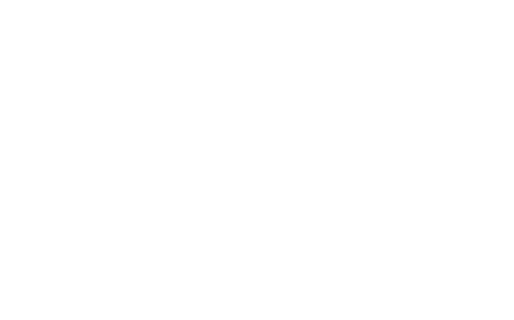
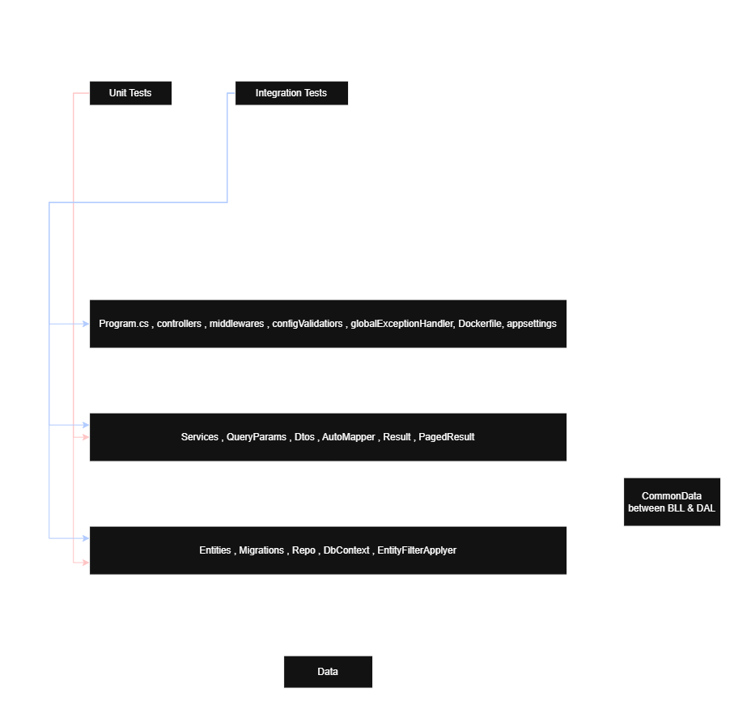
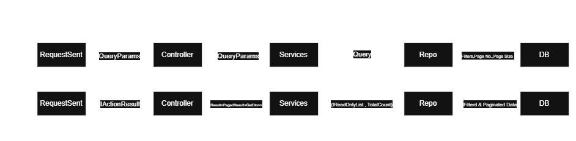

# Akvelon Book Catalog Platform

A REST API for managing a book catalog: books, authors, users, and book loans (borrowing/returning). Built with .NET 10 and ASP.NET Core, backed by MS SQL Server, and fully containerized with Docker.

This project was built over four weeks as a learning project, going from an in-memory prototype to a production-style service with real persistence, structured logging, health checks, and integration tests.

---

## What this app does

The platform lets you manage a small library:

- Manage a catalog of **books** and their **authors**
- Register **users**
- Let a user **borrow** an available book and **return** it later
- Prevent the same copy of a book from being borrowed by two people at once

All list endpoints support **pagination** and **filtering**, and the API returns consistent, predictable responses and status codes.

---

## Entities

| Entity | What it represents |
|---|---|
| **Author** | A person who writes books. One author can have many books. |
| **Book** | A catalog item, linked to one author, with details like title, ISBN, description, publish date, and rating. |
| **User** | Someone who can borrow books. |
| **Loan** | A record of one user borrowing one book — when it was loaned, when it's due, and when (if) it was returned. |

See the **Entities** diagram below for the exact fields and relationships.

<!-- DIAGRAM: Entities -->



<!-- END DIAGRAM -->

---

## Architecture

The solution is split into layers, each with one job. Dependencies only point inward — the API layer depends on business logic, business logic depends on data access, and nothing depends back up.

| Project | Layer | Responsibility                                                                                                       |
|---|---|----------------------------------------------------------------------------------------------------------------------|
| `App_PL` | Presentation | Controllers, routing, middleware, configuration validation, global error handling, Swagger, `Program.cs`, Dockerfile |
| `App_BLL` | Business Logic | Services, DTOs, query parameters, AutoMapper profiles, business rules                                                |
| `App_DAL` | Data Access | Entities, EF Core `DbContext`, repositories, migrations, filtering logic                                             |
| `App_Common` | Shared | Small shared types used by both `App_BLL` and `App_DAL` (e.g. `BookQuery`)                                           |
| `App_Tests` | Unit tests | Tests business logic in isolation, no real database                                                                  |
| `App_Tests_Integration` | Integration tests | Tests the full API through real HTTP calls against a real database                                                   |

A request flows top to bottom: **Controller → Service → Repository → Database**, and the result flows back the same way, getting mapped into a DTO before it reaches the client.

<!-- DIAGRAM: SystemArch -->

<!-- END DIAGRAM -->

### How a paginated, filtered request works

Requests to list endpoints (like `GET /api/books`) carry query parameters for filtering, page number, and page size. The controller passes these down to the service, which passes them to the repository. The repository applies the filters and pagination **in the database query itself** (not in memory), and returns both the page of results and the total count. That total count travels back up so the client always knows how many pages exist.

<!-- DIAGRAM: PagedDataFlow -->

<!-- END DIAGRAM -->

---

## Tech stack

- **.NET 10 / ASP.NET Core** — Web API
- **Entity Framework Core** + **MS SQL Server** — persistence, via EF Core migrations
- **AutoMapper** — mapping between entities and DTOs
- **Serilog** — structured, machine-readable JSON logging with request correlation IDs
- **Docker & Docker Compose** — running the API and database together with one command
- **xUnit** — unit and integration tests
- **Testcontainers** — spins up a real, disposable SQL Server instance for integration tests

---

## Running the app

The easiest way to run everything (API + database) is with Docker Compose.

### Prerequisites

- [Docker](https://www.docker.com/) and Docker Compose installed
- (Optional, for running outside Docker) [.NET 10 SDK](https://dotnet.microsoft.com/)

### 1. Set up environment variables

Copy the example environment file and fill in your own values:

```bash
cp example.env .env
```

Edit `.env` and set `DB_NAME`, `DB_USER`, and `DB_PASSWORD`.

### 2. Start everything

```bash
docker compose up --build
```

This will:
- Build the API image
- Start a SQL Server container
- Wait for the database to be healthy before starting the API
- Apply EF Core migrations so the schema is ready
- Expose the API on **http://localhost:8080**

### 3. Explore the API

Once it's running, open Swagger in your browser:

```
http://localhost:8080/swagger
```

From there you can try every endpoint directly — creating authors and books, registering users, borrowing and returning books, and browsing paginated lists.

### 4. Check the health of the service

```
http://localhost:8080/health/live    # is the process running?
http://localhost:8080/health/ready   # can it actually reach its dependencies (e.g. the database)?
```

### Stopping the app

```bash
docker compose down
```

Add `-v` if you also want to wipe the database volume and start fresh next time:

```bash
docker compose down -v
```

---

## Running the tests

### Unit tests

Unit tests cover business logic and validation rules in isolation — no database required.

```bash
dotnet test App_Tests/App_Tests.csproj
```

### Integration tests

Integration tests exercise the real API over HTTP against a real, temporary SQL Server database (spun up automatically via Testcontainers — you don't need to set anything up manually, but Docker must be running).

```bash
dotnet test App_Tests_Integration/App_Tests_Integration.csproj
```

### Run everything

```bash
dotnet test
```

---

## Project structure at a glance

```
Akvelon_Book_Catalog_Platform/
├── App_PL/                    # API layer: controllers, Program.cs, middleware, Dockerfile
├── App_BLL/                   # Business logic: services, DTOs, mapping
├── App_DAL/                   # Data access: entities, DbContext, repositories, migrations
├── App_Common/                # Shared types used across BLL and DAL
├── App_Tests/                 # Unit tests
├── App_Tests_Integration/     # Integration tests (real HTTP + real DB)
├── compose.yaml                # Docker Compose setup (API + database)
├── example.env                 # Template for required environment variables
└── DESIGN_NOTES.md             # Design decisions and reasoning, week by week
```

For the reasoning behind specific design decisions (why SQL Server, why soft delete, why this concurrency approach, etc.), see [`DESIGN_NOTES.md`](./DESIGN_NOTES.md).

---

## Notes

- Logs are written as structured JSON and persisted to a Docker volume, so they survive container restarts.
- Configuration is validated at startup — the app will refuse to start rather than fail later on the first request if something's misconfigured.
- The app is designed to shut down gracefully: in-flight requests are allowed to finish before the process exits.